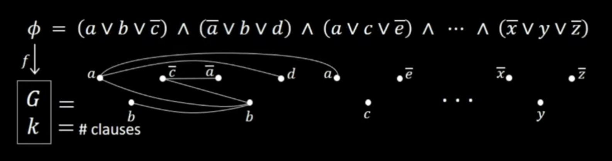
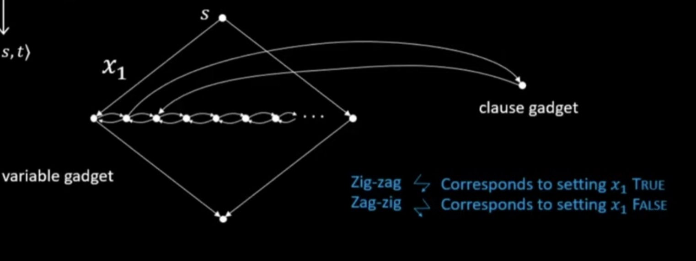
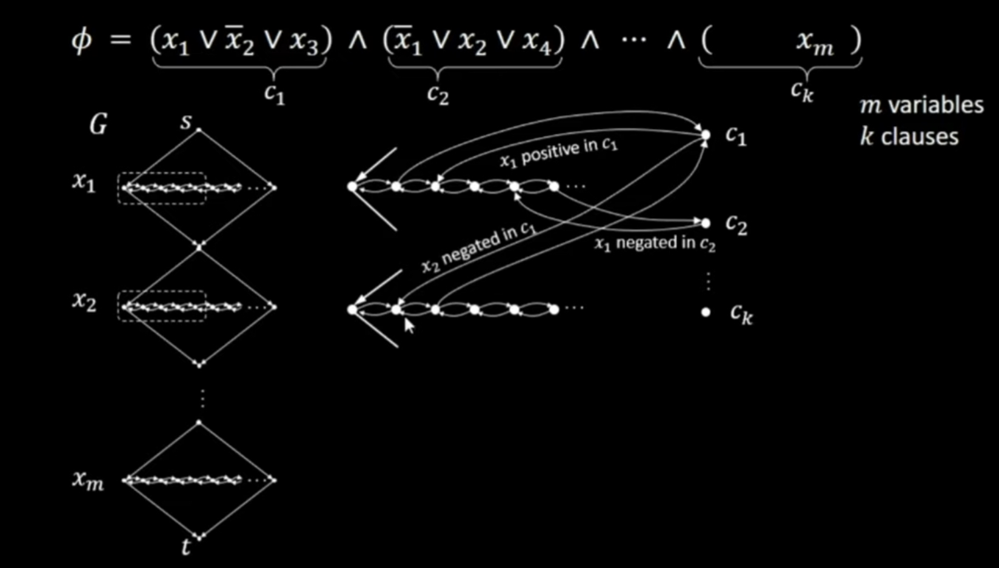
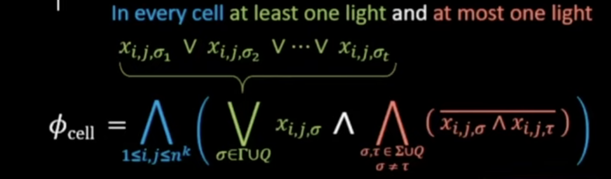
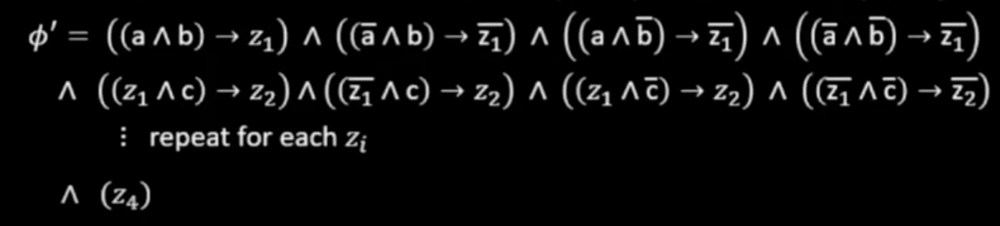

## Complexity Theory(Time Complexity)

We will focus on the time complexity of the decidable languages only.

Time complexity is calculated based on the number steps TM M head moves to produce the output. We give an upper bound for the number of steps required by an algorithm in terms of n, where n is an input length. This is called worst case time complexity.

Time complexity may change based on the computation model we choose. For example, take language 0^n1^n. The time complexity of A on a single-tape TM is O(n * log(n)), and on a two-tape TM it is O(n). Note that the complexity of A depends on the model of computation selected. 

This is an important difference between computability and complexity theory. In computability theory we learnt that both single and double tape Turing machines are equivalent in terms of computability but that is not the case for complexity theory.

Another important thing is that when we go to exponential time complexity even though n2^n grows faster than 2^n we consider both of them to be in exponential complexity. 2.00001^n grows faster than these two but all three of them have the same 2^O(n) time complexity. In general we consider any x^n is in time complexity 2^O(n).

Why do we separate time complexity based on polynomial and exponential time instead of some other classes? It’s because for example if you take n = 1000, n^3 is 1 billion, a large but manageable number, whereas 2^n is a number much larger than the number of atoms in the universe. This is the significance of the exponential time complexity.

### Big O and Small o

Big O:- let f and g be functions which return a real number. Then f(n)=O(g(n)) if some c>0 and n0>0 exists such that for every integer>=n0, f(n)&lt;=cg(n).

Example if f(n)=n, c=2 and g(n)=n then n&lt;=2n. Another one if f(n)=n, c=1 and g(n)=n^2 then n&lt;=n^2. These two implies that n=O(n) and also n=O(n^2). 

Small o:- here f(n)=o(g(n) If for some c>0 and n0>0 exists such that for every n>=n0, f(n)&lt;cg(n). Here note that as n goes to infinity f(n)/g((n) will become zero when we apply the limit. Both the examples above are also valid here. Some more examples are n=o(n^3) and log(n)=o(log(n)).

### Efficient algorithm for the language (a^k)(b^k)

We can use the direct approach of crossing one a and one b until all a’s and b’s are crossed off or any one is fully crossed off. This approach will take O(n^2) time. To understand how we calculate this we can see one of the more efficient algorithms that takes less time than this.

TM M=“on input w:

1. Check all the b’s are followed by all the a’s if not then reject.
2. Until there are no more a’s or b’s:                                                  -> cross of every other a’s and every other b’s. During this loop the even and an odd parity of number of a and b should match if not then reject.
3. If all a’s and b’s are crossed off means accept.”

In this algorithm we analyse stage by stage

Stage 1 takes at most n stents so it is O(n). Then stage 2 runs for log(n) times. This is because each time stage 2 runs half of the symbols on the tape got crossed off. Then each head goes through all of the n tape cells on a tape. Then this stage 2 takes O(n log(n)) time. Then stage three takes O(n) time. Total time=O(n) + O(n log(n)) + O(n) = O(n log(n))

How do we keep track of parity without counting ? When we cross off every other a when there is a at the last without crossing off then it is an even parity otherwise number of it is an odd parity. Same rules apply for b. We don’t need to store the parity in the tape, we can just use the finite memory(just some number of states) to keep track of parity.

Note that if we had a two tape Turing machine we can do this in just O(n) time just by copying all a’s to the second tape and crossing off on both tapes simultaneously.

### Time complexity classes - TIME(t(n))

TIME(t(n)) = {B | some deterministic one tape Turing machine decides language B in time O(t(n))}

E.g A={(a^k)(b^k) | k>=0} is in TIME(n log(n)).

Regular language &lt; TIME(n log(n)) &lt; TIME(n^2) &lt; TIME(2^n)

Note that all regular languages are in O(n) time complexity because DFA is never going to write on its tape. It is going to just read the input one time and give the output. We have to reach O(n log(n)) to get to some non regular languages.

### Multitape vs One single tape Turing machine

We can copy the tape contents of the k tapes into a single tape of the single tape Turing machine by separating them using some separator. Then each time a multitape Turing machine makes one move, a single tape Turing machine scans the whole tape two times, one to decide the next state and second to modify the tape content. Position of the tape heads can be marked using dotted tape symbols. So this takes O(t(n)) time. 

These two passes need to be done for each of the t(n) moves of the multi tape Turing machine. Then the total time taken will be O(t^2(n)). 

 Note that the multitape Turing machine is polynomial time related to the single tape Turing machine because increase in time still belongs to polynomial time.

Polynomial time related computation models:

Single tape Turing machine 

Multitape Turing machine 

Multidimensional Turing machine 

Random races model

Cellular automata.

### P-CLASS

P=U TIME(n^k). Here U stands for union of all.

 problems that are polynomial time decidable in a deterministic single tape Turing Machine. example: finding path between nodes in graph, checking number is prime or composite.

PATH: Path between nodes: PATH= {&lt;G,s,t> | G is a directed graph with path from s to t}

TM M =“on input &lt;G,s,t>

1. Mark node s
2. L1->Until no more nodes marked repeat the following 

                L2->For each node x already marked, 

                    L3->mark all the nodes that can be      reached from x.

3. If t is marked then accept otherwise reject”

Here stage 1 takes O(n) time, note that stage 2 is three levels of nested loop. This nested loop takes O(n^2) time. This is because the innermost loop L3 takes O(n^2) time to find and mark nodes(comparing all possible pairs). Stage 4 takes O(n) time. Note that here n is the number of nodes in the graph.

HAMPATH: HAMPATH problem is similar to PATH problem but this asks for a path between nodes s and t that visits all the nodes in the graph exactly once. The one currently known solution to this problem is to check all possible paths and that will take an exponential amount of time. There is no polynomial time algorithm for this problem as of now. 

Logic: To find all possible paths we can follow the similar approach as the PATH problem using breadth first search but also keeping track of all the visited paths. Then check if any one of these paths contain all the vertices. So each node can have at most the n number of paths to all the other nodes including itself. Then in each iteration number of possibilities will be as follows n*(n-1)*(n-2)*…*2*1=n! and n! is obviously greater than 2^n for all n>=4.

### NP-CLASS and NTIME(t(n))

* **The Non deterministic Turing machine(NTM) is a decider, when the machine halts on all of the branches on all inputs. **
* **Note that this means that the NTM machine(is decidable) will always reject if input is not in the language. If input is in the language then the machine will accept in at least one of the non deterministic branches.**

Then only we will know the longest branch. We say that the NTM runs in t(n) time if all the branches in the machine individually halt within t(n) time.

NTIME(t(n)) = {B | some single tape NTM decides B and it takes O(t(n)) time}

Note that these problems are polynomial time verifiable.

NP = U NTIME(n^k)

 language is in NP class if and only if language that is polynomial time decidable in non deterministic TM. But when we convert that to the deterministic TM it will become exponential time decidable.

### HAMPATH

We don't know whether this problem is in P but we know that this is in NP. For example if you take the HAMPATH(Hamiltonian path) problem. 

HAMPATH = “on input &lt;G,s,t>:

1. No deterministically write a sequence v1v2…v(m) of m nodes
2. If v1=s, v(m)=t, each (v(i), v(i+1)) is an edge and no v(i) repeats, then accept. Otherwise reject.”

In stage 1 we will generate a sequence of bits to represent m nodes. It will be a big binary tree where each of the leaves of this binary tree will give us one complete sequence. Height of the tree will be (m log2(m)). There will be 2^(m log2(m)) such possible sequences. Here log2(m) is the number of bits to represent each of the m numbers corresponding to m nodes.

The non deterministic part generates all possible permutation strings of nodes of length n with repetition. Then later for each such string we check in stage 2 the repetition of nodes and correct start and end nodes and all consecutive nodes that have edges in the graph. 

Here note that Non deterministic TM N can generate all possible nodes non deterministically and we will only consider any one of the longest branches for time complexity. So it will have polynomial time. 

But when we convert this to deterministic then to generate all such strings there are n^n such possible strings for graphs with n nodes with repetition allowed.

### COMPOSITE problem 

COMPOSITES = {x | x=yz in other words x is not prime and x is in binary form}

TM M =“ on input x:

1. Non deterministic list all the numbers y where 1&lt;y&lt;x.
2. If x=yz then accept otherwise reject.”

Here non deterministically listing all the binary numbers will work in a similar way as HAMPATH non deterministic logic. Some binary tree of height n will list all the binary numbers of length n.

Note assuming input itself in unary form(number k in the form 1^k) will move the exponential time out of the problem then that would seem polynomial. But this is a bad encoding.

Also note that the COMPOSITE problem is in P-class now proved in the year of 2002. This algorithm works by checking some properties of a number without directly checking the factors.

Note that we can check whether a number is prime or not in polynomial time, but we don’t have a polynomial time algorithm to find the prime factors of a composite number. We have to check all possible prime numbers(less than the composite number) to see whether that is a factor of that composite number. This is the base of the RSA encryption algorithm.

### P vs NP

P =the class of languages for which membership can be decided or tested quickly. Here we can easily decide(or find) the path between two nodes.

NP= the class of languages for which membership can be verified quickly. Here verifications like whether the given path is Hamilton path is easy.

If we can prove there is some language in NP but that is never going to be in P then we can show that the NP!=P.

### A_CFG in P-class using dynamic programming(DP)

This implies that every CFL is in P-class.

We have already seen that after converting CFG to Chomsky normal form(of the form A->AB or B->B) all the strings w of length m are generated by the derivations of length (2|w|-1). First see the non deterministic approach,

NTM N=“on input &lt;CFG_G,w>

1. Non deterministically generate some derivation of length (2|w| - 1). Then only generated string using this derivation procedure will have length |w|.
2. Accept that derivation generates a string w. Otherwise reject”

Now we will see the deterministic approach using dynamic programming. So dynamic programming is actually memoization, that is, we store previously solved problems in some table to avoid re-computation. The given below algorithm checks whether we can generate w starting from variable R.

TM C=“On input &lt;G,w,R>:

1. First check whether &lt;G,w,R> is an already solved problem then use the previous solution.
2. L1->Otherwise for each way of splitting w=xy and for each rule R->ST
3.        L2->Check use C to test &lt;G,x,S> and &lt;G,y,T>
4.        L2-> if both accepts then accept
5. If none of the above is accepted then reject.”

Without stage 1: 

-> First analyse this problem without stage 1. In stage 2 splitting w in all possible ways will require n time because we can put the splitter in position 0,1,2,…n. Checking for all possible R->ST is going to take m^2 amount of time where m is the number of variables in the grammar because there are m ways to choose S and m ways to choose T in the worst case scenario.

-> if we splitted w on the first position then the length of y will be n-1. Then recursive calls continue to split in the same way. In the first recursive call each of the n splitted strings is going to be again splitted into the n times. So there are (n*m^2)^n steps required without stage 1. 

Note: If tree contain log(n) levels and each level take n number of steps then total number of steps will be the sum of n for log(n) times=(n+n+…n) =n*log(n). But in our case first level runs for n steps(it is actually n*m^2 but for simplicity we take just n) as a side effect creating n branches. Then each of these n cases is going to run for n steps in the second level, so the total number of steps in the second level will be n^2 and each of these n^2 steps are going to create another n number of branches. So in the third level each of these n^2 cases are going to take n number of steps so the total of n^3 steps and so on. When is it going to stop? Each time when we go to one deep level the longest substring in that level is going to shrink in length one because of splitting. So at some level there will be no more split possible. That will be at level n. So at level n it will take a total of n^n steps. Then Total number of steps taken by this algorithm will be n + n^2 + … + n^n = O(n^n). That’s why we say this problem takes exponential time.

With stage 1:

-> To understand this first note that there are only n^2 possible substrings in the string w. Because we can split a string into 2 pieces,3 pieces,…,n pieces. Each of these categories the possible number of substrings are n,(n-1),(n-2)…3,2,1. So the sum of these numbers will give us n^2. Then each of these substrings will be checked for at max the m^2 number of derivation rules of the form R->ST. So the total number of steps will be (n^2 * m^2).

-> This is because in the previous approach a lot of computations are redundant. To avoid that we use the table to store previously computed results. If &lt;G,x,T> is in that table we don’t go to stage 2 at all. So this stage 1 makes it a polynomial time algorithm.

Logic: in a table index (i,j) we will store all the variables that can derive substring of w that starts at position i and ends at position j. By passing around this (i,j) value in the previous recursive algorithm we can achieve what we have discussed.

Bottoms up approach:

TM U=“on input &lt;G,w,R>:

1. For each w[i] and for each variable R: Solve &lt;G,w[i],R> by checking whether it corresponds to some R->w[i].
2. For each k=from 2 to n for each substring u of w where |u|=k and for each variable R: solve &lt;G,u,R> by checking whether for all possible splits u=xy and variable R->ST whether &lt;G,x,S> and &lt;G,y,T> are positive in the table.
3. If &lt;G,w,R> is positive in the table then accept, otherwise reject”

### Co-NP

 Verifying that something is not present seems to be more difficult than verifying that it is present. We make a separate complexity class, called coNP, which contains the languages that are complements of languages in NP. Like a complement of CLIQUE, SUBSET-SUM problems.

* There is a problem in NP for every problem in coNP, and vice versa. For example, the SAT problem asks "does there exist a boolean assignment which makes this formula evaluate to True?". The complement problem, which is in coNP, Asks that "do all boolean assignments make this formula evaluate to False?" 
* Here we don’t have some certificate that can prove the membership of the language because to prove this we have to test all possible combinations. But there is a certificate for non membership. Such that some instances will evaluate to true.
* So for coNP problems we will have a certificate for the “no” instance (e.g Boolean formula that is not in the complement of SAT problem) that corresponds to a “yes” instance that is a complement problem (SAT problem) in NP. 
* On the other hand, the certificates for a “yes” instance of a coNP problem will have the same complexity as a “no” instance in the corresponding NP problem.
* Note that when we are finding a complement of some language, remember that universal and existential quantifiers are opposite to each other. E.g. “There exists acceptance” is an opposite “rejection of all”.

So note that the complement of “accepting all the strings” will be “There exists a rejection string”.

**E.g some languages are neither NP nor Co-NP**

ALL_NFA = {&lt;A> | A is a NFA and L(A) is all strings}

COMP_ALL_NFA = {&lt;A> | A is a NFA and A rejects at least one string}

* Here this language is neither NP nor Co-NP. Why? Because if you are given some certificate &lt;A> for either of these languages to verify that we have to check all possible strings against the NFA A. This will take exponential time. 
* If there are m input symbols and q states then there will be m^q possible strings. Even if we guess each symbol non deterministically we have to do 2^q non deterministic guesses before confirming the result. Because there can be 2^q possible state configurations for this NFA.

COMP_ALL_NFA =”on input &lt;A> where A is NFA

1. Place the marker on the start state
2. L1: Repeat the following stage for 2^q times
3.       L2: non deterministically choose one input symbol and move the marker as if the   machine read that chosen input symbol.
4. If stage 2 or 3 rejects some string in these 2^q steps then accept otherwise reject.” \

How?

* Here note that there 2^q non deterministic choices each will create different non deterministic branches. If any one of these branches reject some input string then we can accept that language. Then If any one of non deterministic branches accepts then the whole machine M will COMP_ALL_NFA will accept. 

If there is some rejecting string that is longer than 2^q then it must have a repeating substring. We can remove that repeating part to get a shorter rejecting string. Here repeating means the machine will go through the same path of states for multiple times. By removing the repeating parts we avoid these looping steps.

### NP-COMPLETE

 problem B is in NP-complete class based on two conditions. First B is in NP-class and every problem A in NP-class is polynomial time reducible to B.

Another way to prove that a problem is NP-complete is reducing it from some already proven NP-complete problem.

If any NP problem for sure needs more than polynomial time then we can use the proof by contradiction like we used with A_TM to prove all the NP-complete problems need more than polynomial time.

If any NP-complete problem only needs polynomial time, it means we can decide all NP problems in polynomial time.

For example, the SATISFIABILITY problem is NP-complete. A Boolean formula is satisfiable if there is some assignment of 0's and 1’s to the variables that will evaluate formula to 1.

### 3SAT

A Boolean formula P is in conjunctive normal form(CNF) if it is in the form P=(x v y v z) ^ (~x v z v y v w) ^…^ (y v ~z). Here note that all the clauses must be true to P to be true. In 3CNF all the clauses must contain exactly three literals.

Note that we can always convert any Boolean formulas into conjunctive normal form(but not in polynomial time in general). The resulting formula might be exponentially large. Note that converting Boolean formula into CNF may take exponential time. So to prove that 3SAT is NP-complete we won’t reduce it from SAT problem. Instead we directly modify the proof of the SAT problem to produce a Boolean formula in 3CNF form. This approach will only take polynomial time reduction.

3SAT = {P | P is a satisfiable 3CNF formula}

### CLIQUE

* The clique of the graph is a set of nodes of the graph such that each distinct pair of nodes are adjacent(connected by an edge) to each other in that set. In other words all the k nodes in the k-clique will be connected with all the other k-1 nodes.
* A k-clique is a subset of k nodes of the graph such that any pairs of these k nodes are connected by an edge.

CLIQUE ={&lt;G,k> | graph G has a k-clique it it}

* Clique is NP because if you are given a k-clique as a certificate then you can verify it in polynomial time. But if you are given a graph and asked to find a k-clique in it then it will take exponential time. 
* Because if there are n nodes in a graph and we have to check all possible k combinations of them to check whether there is some k-clique in the graph. Based on the combinatorics to choose k nodes from n nodes it will  have ((n!) / (n-k)!) ways. We know that factorial grows faster than exponentiation.

### 3SAT is polynomial time reducible to CLIQUE

Remember that this logic works not just for a clause with 3 literal but also for a clause with any number of literal.

We are going to convert the 3CNF formula P with k clauses to the graph G which has 3k nodes. Then finding a k-clique in the graph G will solve the 3CNF formula P.

E.g.  P = (a v b v d) ∧ (~a v c v ~d)

Procedure:

1. Each clause with three literals in the P should be converted to a group of three nodes in graph G.
2. In graph G two kinds of nodes will not have an edge between them. First is the nodes corresponding to the literals from the same clause of the P. For example in the above P a and d will not have edge in between them.
3. Second, the nodes correspond to the complement of each other like a and ~a.
4. Find a k-clique to solve the 3CNF problem.

Why?

Stage 1: we need some way of one to one correspondence with P and G for that only we have one node in G for each literal in P. So now choosing a particular node corresponds to assigning 1 to that literal. We have k such groups in G to replicate the k clauses in the P.

Stage 2: First we will find a k-clique to find a solution to the formula P. So we must choose exactly one node from each group otherwise we might miss out on some groups in k-clique. If we missed some groups that will correspond to not choosing a true literal for the corresponding clause of the formula P. So to make sure we choose exactly one node from each group of 3 nodes in G we disallow an edge between nodes in the same group.

Stage 3: we disallow an edge between a and ~a because that will correspond to assigning 1 to both a and ~a. This will be an invalid assignment.

Stage 4: we choose k-clique because there are k clauses in a formula P. So each node in a clique will correspond to a true literal in a Boolean formula P.

So we have one to one correspondence between clique nodes of a k-clique of G and exactly one true literal from each of the k-clauses of P. If there is more than one true literal in the same clause of P then we can randomly choose any one.

Fun fact: for 1SAT problem graphs will have just k nodes corresponding to k literals of the k clauses of the boolean formula P. So if the whole graph G is k-clique or in other words a fully connected graph then only the Boolean formula P is solvable otherwise there will be no solution for that boolean formula.

The given image below gives you the idea of how we create variable and clause gadgets for the 3SAT problem in CLIQUE graph G. Here not all the edges have been added.

### 3SAT is polynomial time reducible to HAMPATH

In the above diagram you can see the diamond structured variable gadget connected with clause gadget. It is the building block of the graph G from the Boolean formula P.

Building rules nodes:

1. Add one diamond structure with four nodes for each variable in a Boolean expression. In the diamond, the left end node corresponds to x means then the right end corresponds to ~x.
2. Then we will add independent nodes c1,c2,…,c(n) which correspond to each clause of the expression P.
3. Then between these two nodes x and ~ x we need to add a chain of nodes. In a chain each pair of nodes corresponds to one clause in P. And each pair is separated from the other one by a single node.

Why?

Stage 1: we have one diamond structure for each variable in an expression so that when we find the Hamilton path we will assign the truth value for each and every variable.

Stage 2: We add independent nodes c(i) that will make sure we select at least one true literal from each clause then only the whole expression will become true

Stage 3: the chain of nodes corresponds to a connection between variables and clauses. If a clause contains variable x then we will have a detour from the chain that corresponds to the diamond of variable x to a clause that contains variable x. We have a separator between each pair so that when we go to detour from a particular chain we must come back to the next node in that same chain, otherwise we will miss this separator node in the Hamilton path. This is to avoid cases where we detour from one chain and go to some other chain from a particular clause.

Building rules of Edges:

Note that this is a directed graph. It is a necessary condition for our proof.

1. You can see in the diagram you can either traverse the diamond in a clockwise direction(zag zig) or in anti clockwise(zig zag). Traversing any-clockwise corresponds to assigning true to x and clockwise corresponds to assigning true to the ~x.
2. We will add the detour from the chain to the clause c(i) based on how that variable appears in the clause. If clause contains x then we will add a detour such that we can detour to the c(i) only when we traverse the diamond in anti-clockwise. Similarly if ~x is in clause then we will add a detour such that only clockwise traversing can detour to the clause.

Why?

Stage 1: we can either clockwise or anti clockwise to make sure we assign true either x or ~x not to both.

Stage 2: Each variable gadget (diamond) will be connected to multiple clause gadgets through the chain. So either when we assign true for x we can visit all the clause gadgets which contain x as the literal or when we assign true to the ~x then we can visit all the clause gadgets which contain ~x as the literal. 

This way if there is some truth assignment to the variables that evaluates an expression P to 1 then that will give us a direct way to visit all the nodes in the graph. Reverse is also true here.

### SAT is NP-complete(Satisfiability). Cook-Levin theorem

First SAT is NP. The SAT problem asks for the values of the boolean variables for which the boolean expression will evaluate to 1. Assume that there are n number of variables in an expression. Number of literals in an expression is m>=n.

-> First, we can try all 2^n combinations of values of n variables to find the solution but it takes exponential time.

-> Second, we can try to manipulate the Boolean expression as a string and try some values for the first literal based on the symbol around them like ‘(‘, ’)’, ‘∧’, ‘v’… and then for the second literal. But if there is something like this ((a v b)∧(~a v b)∧(~a v ~b)). First we can either choose 1 for a or b. But later that will affect the choice of the second and third part. Sometimes choosing 1 for a will work, sometimes choosing 1 for b will work(here in our case b=1). Sometimes both will work. But we don’t know that at the initial time. So in this method also the first literal has 2 choices 0 or 1, the second literal has 2 choices and so on. Total 2^m choices will be there which is exponential.

->SAT problem is the first problem that is reduced from all other NP problems in Cook-Levin theorem. We do this by showing a way to find an accepting computation history of any TM M using some Boolean expressions P. This Boolean expression will evaluate to 1 only when values of its variables correspond to accepting the computation history of the NTM M.

SAT = { P| P is a satisfiable Boolean formula.}

->Polynomial time reducibility: it is the same as mapping reducibility but the reduction should happen in polynomial time.

Note in PCP the problem finding a match was forcing us to simulate a Turing machine M on input w. Here finding a satisfying assignment is going to force us to simulate a machine M on input w. Both are computation history methods.

Core logic: To prove that all NP problems are polynomial time reducible to SAT we will show that any NTM M and input w can be converted to a boolean expression P. If we find the satisfiable assignment to that boolean expression that will correspond to an accepting computation history of M on input w.

**Accepting Tableau**: is a table where each row in it contains configuration of a turing machine. First row will contain start configuration and last row will contain accepting configuration and each row in between will legally follow from previous row configuration.

 We want to represent that accepting tableau using some boolean expression P. So that if we find a satisfying assignment to P then that will help us fill all the cells in this accepting tableau. Which will lead us to finding accepting computation history.

Assumption: We assume that the time complexity of NTM M is n^k. So M can make at most n^k right moves on the tape. So the tableau will have n^k columns and n^k rows to store the accepting computation history. In our proof symbols means the union of tape symbols and input symbols. 

There are four building blocks of this boolean expression namely P(cell), P(start), P(accept), P(move). We will see one by one each of these four parts.

#### P(cell)

It is a boolean expression that ensures that when assigning truth values to the variables we choose exactly one symbol for each cell of the tableau. Here p(i,j,x) represents a variable in a boolean expression P. below you can see the big OR notation you see in green colour forces that at least one symbol must be chosen for each cell. Big AND in red colour forces that at most only one symbol must be chosen for each cell. So overall this boolean expression ensures that exactly one symbol is chosen for each and every cell of the tableau.

#### P(accept) and P(start)

  P(accept) and P(reject) will ensure that start and accepting configurations are valid ones when we are assigning the truth values to all the variables in the final boolean expression P. This can be done using the following two boolean expressions. For start configuration we just match each cell with corresponding start configuration symbols on the tape which we already have given as an input. For accepting configuration we will just check the last row contains q(accept) state in it. Here note that q0 is the start state and input w=w1w2…w(n) and underscore represents a blank symbol. Here note that n^k is n to the power k.

**P(start) = p(1,1,q0) **∧** p(1,2,w1) **∧** p(1,3,w2) **∧** … **∧**  p(1,n,w(n)) **∧** … **∧** p(1,n^k, _).**

**P(accept) = p(n^k, 1, q(accept)) V p(n^k, 2, q(accept)) V … V p(n^k, n^k, q(accept))**

#### P(move)

So P(move) is going to ensure each configuration legally follows from the previous configuration. To check this we check the whole tableau as small sub tables of size 2x3. So for each cell from i = 1 to n^k and j = 1 to n^k we will check if the 2x3 window(or neighbourhood) of that cell is one of the legal windows allowed by NTM M. Then this will ensure that the whole tableau is legal. How do we get all of the legal moves? There are finitely many states, tape and input symbols in the NTM M. If there are a total of m symbols then we can find all combinations of six symbols in m^6 steps. Then we can check each window whether it follows the rules of the transition functions and rule out the ones that are not valid. Then we can use this set of legal windows to construct the below boolean expression. Here in this expression we are writing the indices numbers from 1 to n^k. This will take the addition of log(n^k) time but that is not an important thing.

**Final boolean expression P = P(cell) **∧** P(start) **∧** P(accept) **∧** P(move). Then this will imply that any satisfying assignment to this boolean expression will directly lead into the accepting computation history of NTM M on input w.**

### 3SAT is NP-complete

* We are going to give a reduction for converting P to P1, where P1 is a 3CNF formula. We can find the logical equivalent of any boolean formula to the 3CNF formula but that will take exponential time.
* So here P and P1 are not going to be logically equivalent but it is going to preserve the satisfiability. That means P1 will be satisfiable if and only if P is satisfiable. 
* So if P1 is satisfiable then NTM M accepts input w. So we are going to do this by adding additional variables.

Logic: we are going to achieve this by replacing each of the (a ∧ b) and (a v b) by given below equivalents.

* (a ∧ b) = ((a ∧ b) -> c) ∧ ((~a ∧ b) -> ~c) ∧ ((a ∧~b) -> ~c) ∧ ((~a ∧ ~ b) -> ~c)
* (a v b) = ((a ∧ b) -> c) ∧ ((~a ∧ b) -> c) ∧ ((a ∧ ~b) -> c) ∧ ((~a ∧ ~b) -> ~c) 

Then we can use the fact that (a ∧ b) -> c = (~a v ~b v c) to get the 3-CNF form.

E.g ((a ∧ b) v c) ∧ (~a v b). You can see in the below image we introduced new variables z1,z2,... 

Here note that z1 is the values of (a ∧ b) and z2 is the values of ((a ∧ b) v c). We are using these new variables in the next next steps. If there are k boolean operations in the original formula then there will be 4k+1 clauses in the generated 3CNF formula.

### Reductions from SAT problem:

-> 3SAT - is a booleans expression in 3-cnf form.

Reduction from 3SAT:

Here the k number corresponds to k clauses of the 3SAT problem. In each reduction we try to find variable gadget and clause gadget which corresponds to variables and clauses of 3SAT problem.

-> **CLIQUE** - is a problem of selecting a set of k nodes in a graph G such that each of the k nodes will have an edge to each of the other k-1 nodes.

-> **VERTEX COVER**- is selecting a set of k nodes which is connected(covering) with all the edges of the graph. In other words all at least one side of all the edges of the graph will be connected with at least any one of the nodes among the k nodes.

->**HAMPATH**- is a problem of selecting the Hamilton path which connects a particular number of graph nodes without visiting the same node more than once. In reduction this particular number of nodes directly corresponds to the number of variables and clauses of 3SAT problem. If we solve HAMPATH then we can solve 3SAT.

->**UHAMPATH**- same as HAMPATH but for an undirected graph.(uses the proof of HAMPATH). We will use the graph G in the HAMPATH problem and add three nodes u_in, u_mid and u_out for each node u in the graph G to construct a new undirected graph G1.

->**SUBSET-SUM** - is a problem of finding the subset of elements that will have a sum of t. Here getting the correct sum will force us to assign the truth value to each variable of a Boolean expression and also will force us to assign true to at least one literal from each clause. 