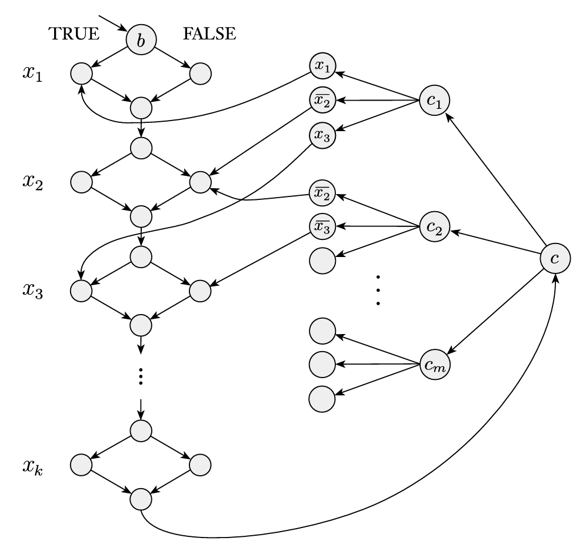

## Complexity Theory(Space Complexity)

 The space complex seems more powerful than time complexity because we can reuse space but not time. For example SAT problem is in linear space complexity, where it is not even polynomial time complexity but exponential.

Algorithm that uses f(n) time complexity cannot use more than f(n) space based on our definitions. Otherwise time complexity also should increase. Though the reverse is not always true.

f: N->R+, f is a function that returns a real number.

**SPACE(f(n)) **-  { L | L is a language that is decided on O(f(n)) space in a deterministic 1-tape TM }.

**NSPACE(f(n))** -{L | L is  a language that is decided on O(f(n)) space(considering only one long branch) in a 1-tape NTM}.

* **Note: TM should halt on all inputs and NTM should halt on all branches on all inputs.**
* **Note that this means that the NTM machine(is decidable) will always reject if input is not in the language. If input is in the language then the machine will accept in at least one of the non deterministic branches.**

**PSPACE** - class of languages that are decidable in polynomial space in deterministic TM. Class of languages that has SPACE(n^k) space complexity

**NPSPACE** - class of languages that are decidable in polynomial space in NTM. Class of languages that has NSPACE(n^k) space complexity.

### TIME vs SPACE(P and NP are subset of PSPACE)

All the TIME(f(n)) time algorithms are subset of SPACE(f(n)) languages.  This implies P is a subset of PSPACE. 

->All the SPACE(f(n)) algorithms are a subset of TIME(2^O(f(n))) or equivalently TIME(c^f(n)) where c is the number of tape alphabets and n is tape length. This is because if you remember about linear bounded automata. There is an upper limit for the number of configurations we can have for a tape length of f(n). This time it takes will be (m*n*c^n) where m is the number of states. The n in the second place corresponds to a number of possible head positions on the tape.

Where f(n)>=n in both cases.

The above two statements are easy to prove. We can derive those results from the same Turing machine that uses f(n) time or f(n) space.

#### NP is subset of PSPACE:

* To prove this, first remember that the SAT is in the PSPACE. We can just try out all the possible inputs to find the satisfying assignment. This will reuse the same space to store inputs.
* all NP problems are polynomial time reducible to SAT so this directly implies that NP is a subset of PSPACE. Remember that SAT can be converted into deterministic TM which uses only polynomial space and exponential time by using constant space to compute all possible input combinations for Boolean variables.
* Here we are only saying that NP is a subset of PSPACE. But we don’t know yet whether it is a proper subset of PSPACE. Because we don’t know how to differentiate PSPACE from NP or P. To prove this we have to find a problem that can solved with PSPACE but not using P or NP.

coNP is also a subset of PSPACE:

->Why? 

First thing coNP is a subset of coPSPACE and 

the second thing is because coPSPASE=PSPACE due to the fact that all of the languages in the PSPACE are deterministic(because there are finitely many configurations in a machine with fixed tape length) , we can just negate the output of the PSPACE problems to get the answer for the problems in the coPSPACE. 

Converting multitap TM to single tape TM just increases the space by constant factor. For example if there are k tapes means space will be something like (k*n + c).

### Savitch’s Theorem (PSPACE=NPSPACE)

First see the ladder problems before exploring this to get a better idea of what we are doing.

Note: the proof for showing NP is a subset of the PSPACE using SAT problem which we have previously is different from this proof. That proof implies that the machine that uses non deterministic polynomial time will use deterministic polynomial space. 

Savitch’s Theorem will prove that all the non deterministic polynomial space algorithms will use deterministic polynomial space. Note that this implies that NP is a subset of NPSPACE.

This theorem says that any non-deterministic TM NTM N that uses f(n) space can be converted to a deterministic TM M that uses (f(n))^2 space. 

So the set of NP time languages is a subset of PSPACE. Because all NP time problems use O(f(n)) time in a NTM. That means they will use at most O(f(n)) space on NTM on all inputs. Which can be converted to polynomial space complexity TM based on Savitch’s theorem.

If some NTM takes O(f(n)) space means one of the non deterministic branches takes this much space. If we sequentially check whether we can go from one configuration to the next configuration then at each level of the recursion we have to check whether any of the configuration c2 can be reached from c1 and then c2 to c3 and so on. Then the depth of this recursive checking will be t. t = c^(O(fn)) where c is the size of the alphabet and O(f(n)) is tape length. So this approach will need exponential space. To avoid that we will use a divide and conquer kind of approach.

 We will check whether from start configuration c1 to some end configuration c2 using at most t steps. To do that we recursively call the same CANYIELD function for inputs &lt;c1,c(m),t/2> and &lt;c(m),c2,t/2> for all possible configurations c(m). Whenever CANYIELD calls itself it stores current level, c1, c2 and t on the stack. So at each level we will use at most f(n) space.

If you remember about the linear bounded automata LBA. When we know that tape length there is an upper bound for maximum time it can take without a loop. So we can use that to get an upper bound for a number of possible configurations that are possible without encountering an infinite loop. That value will be 2^O(f(n)) or equivalently c^f(n). Where c is the size of the alphabets.

So if the branch uses f(n) space then it will take a maximum time of t=c^O(f(n)) for the longest recursive branch. 

In linear bounded automata this number represents the maximum number of configurations possible.

Since we divide the configuration in two halves for each recursive call. So the depth of the recursive calls tree will be log2(t). At each level we use the f(n) space. So the total of log(t)f(n)=(f(n))^2 space is used.

How do we find c(m) here? Actually we don’t find c(m) but rather check for all possible c(m) configurations because of the fact that the tape length is bounded to f(n). But this for loop is going to store only f(n) to store c1,c2 and t values. All c(m) values are part of the machine or dynamically calculated using constant space.

#### Recursion reusing space at same level of recursion tree:

* Even though there are multiple branches in the same level, how are we saying that each level uses only f(n) space? This is because when a program is executed it is going to follow the pre order traversal kind of execution pattern. The other way to think about this recursion will happen in analogous to the depth first search method. As it goes further deeper into a particular branch it will push the values to the stack data structure then as it comes back to the previous level it pops data back from the stack. So as we come back to previous levels we will reuse the same part of the stack for all the branches in that level one by one.
*  Because at the low level one branch is fully completed before going for the next branch we are able to reuse the space of multiple branches in the same level. So all the nodes in the same level are going to reuse the same f(n) space for computation. Remember that when we calculate time we have to consider the sum of time used by all the nodes in the same level because time cannot be reused.

How do we find the value of f(n)? Since we know that NTM is going to halt on all branches by only using f(n) space then there will be some value of f(n). So we try values from 1,2,3… for f(n) until we find the one that satisfies. Or we can assume for the proof that t = c^(f(n)) or t = 2^(d * f(n)).

How do we figure out the accept configuration? **We modify the NTM N such that on reaching the accept state it will clear the tape and move the head to the leftmost cell. ** By doing this we are making sure there will be a single accepting configuration. Just a side note L2 is the code which comes inside the loop L1.

CANYIELD=“on input c1, c2 and t:

1. If t=1 then check whether c1=c2 or c2 can be derived from c1 based on the rules of N. If anyone is true then accept and reject if both fails.
2. L1: if t>1 then for each configuration c(m) of N using the space f(n):
3.          L2: CANYIELD(c1, c(m), t/2) note: using at most t/2 steps
4.          L2: CANYIELD(c(m), c2, t/2)
5.          L2: if both accept then accept.
6. If not yet accepted then reject.”

TM M=“on input w:

1. Output the result of CANYIELD(c(start), c(accept), 2^(d * f(n)) ).”

We select constant d such that machine won’t take more than 2^(d * f(n)) steps for the space f(n).

Remember that total number of configurations possible are |Q| * f(n) * c^f(n). Q is a set of states and c set of alphabets.

### NPSPACE= Co-NPSPACE

* We already proved that all the NPSPACE(f(n)) TM can be converted to PSPACE((f(n))^2) TM in Savitch’s theorem. So we can use this deterministic TM to decide the Co-PSPACE problem in polynomial space. 
* But remember that this may take exponential time. That’s why we couldn’t prove that NP=Co-NP using a similar approach. We don’t have polynomial time reduction from NP problems to Co-NP problems. Another way to think about this is, we don’t know whether the looping non deterministic branches will accept or reject to decide co-NP problems.
* But we have polynomial space reduction from NPSPACE to Co-NPSPACE.

### PSPACE-complete 

A language B is PSPACE-complete if it satisfies following two conditions,

1. B should be in PSPACE
2. Every language A in the PSPACE is polynomial time reducible to B.

If the language B only satisfies the second condition that means B is not in PSPACE then the class of the language is called PSPACE-hard. 

Here note that the language A should be polynomial time reducible to the language B(the word time is key here). That’s why some problems are not in PSPACE and are polynomial time reducible from every language A from PSPACE is in a separate category.

Remember that if the reduction takes polynomial time then it must use at most polynomial space. The main thing here is the polynomial time reduction segregates more hard problems in PSPACE to the PSPACE-complete class which is what we wanted. 

If B is in PSPACE and if all languages B are polynomial space reducible to B then it doesn’t make any sense because both of them are already in PSPACE. So this approach doesn’t give us a way to separate hard problems into a separate category. That’s why we use polynomial time reduction. We want very simple transformations to be reductions like polynomial time reductions. We don’t want to make the reduction itself more complicated. There are some reductions that are weaker than P. That is Log space which is properly inside P.

### Ladder problem

Ladder: is a sequence of strings all with the same length and consecutive strings will differ in just one letter.

E.g let A be a language, ladder in A is the ladder that can be formed using strings in language A.

LADDER_DFA = {&lt;B,u,v> | B is a DFA and L(B) contains a ladder y1,y2…,y(k) where y1=u and y2=v}

#### LADDER_DFA is in NSPACE(n):

->First we make sure that we don’t store the whole sequence because even though we are guessing words non deterministically the depth of the non deterministic tree itself will become exponentially large then we won’t be able to prove that this problem takes polynomial space in NTM.

->Second we set the upper bound for the depth of the non deterministic tree using the length of u.

LADDER_NPSPACE=“on input &lt;B,u,v>

1. Let y= u, m=len|u|, and n=size of the alphabets from which all the strings are made.
2. L1: repeat the following for t times where t=n^m:
3.       L2:Non deterministically change one letter of a word y.
4.       L2: if the y does not belongs to L(B) then reject 
5.       L2: if y=v then accept
6. Reject if not yet accepted.”

Why does it work?

Stage 1: is straightforward just assigns variables.

Stage2: we want to check for t=m^n times because there are a total of t possible words of length n that can be formed with m alphabets. Then after t steps we will encounter the same word again because of the pigeonhole principle. If the same word comes then we will check one of the same paths which we checked already because of stage 3.

Stage 3: is key logic here. Because we are non deterministically changing one letter in a word, we will cover all possible ways that the word can change in different branches at the same level of the non determinism. Then we can ask by storing already visited words we can break out of the loop before t steps but there is possible this happens at the t steps. If it happens near the t steps then we need to store all those words which require exponential space because t is an exponential number with respect to the inputs. That’s why we choose to always check all the t steps so that we don’t need to store words in previous levels. After the t steps word must be repeated and that will become an infinite loop.

Stage 4: if the word is not in the L(B) then ladder is not valid so reject.

Stage 5: if y = v then we got a valid ladder so accept.

Stage 6: after t steps if we still didn’t accept then there is no valid ladder in L(B) so reject.

So this implies that the LADDER_DFA is in non deterministic polynomial space. It uses just O(k) space where k=m+log|t|. Here log2|t| space for storing count of a number t. Which can be reused in all of its branches at the same level.

#### LDDER_DFA is also in SPACE(n^2):

First we will see a direct approach using bruteforce(trying every possible way to change the current word) recursion then we will see a more general approach that uses bruteforce together with divide and conquer approach.

This direct approach may seem like working but it takes exponential space for the reason explained here.

LADDER_WRONG = “on input &lt;B,u,v,t>:

1. Let y= u, m=len|u|, and n=size of the alphabets from which all the strings are made.
2. If t is greater than m^n then reject.
3. L1:for each letter b in y:
4.      L2:for each alphabet c in the L(B):
5.           L3: temp := change b to c in a word y
6.           L3: if temp doesn’t belong to B then reject.
7.           L3: if temp = v then accept.
8.           L3:Get own description of a machine and call LADDER_PSPACE(&lt;B,y,v,t-1>)
9. If not accepted in one of the branches then reject.”

Why does it work?

Stage 1: It is a straightforward assignment.

Stage2: For the same reason discussed above we reject after t steps. Because we covered all the possible ways each word can change in different branches of the recursive tree. And all the branches in the same level can reuse the same space. Whatever stage 2 of LADDER_NPSPACE done is achieved by recursion here.

Stage 3,4,5: stage 3 of LADDER_NPSPACE non deterministically changed each letter of the word y. The same thing is achieved here by these two loops. Inside this for loop program will need some space temp which can be reused in each iteration because we don’t need previous iteration value of temp. Also all the alphabets are part of input B.

Stages 6,7,9: these are the same as stages 4,5,6 in the logical perspective.

Problem with stage 3,4,5: In the non deterministic approach(LADDER_NPSPACE) we changed each letter of y non deterministically in stage 3. Even though we are calling it a tree it is not the same as a recursive tree; it has the power of non determinism to change all the letters at the same time non deterministically. Because of that it doesn’t have to store the value of y when it goes to the next deeper level of the non deterministic tree. 

But in the recursive tree we have to retain the value of current y to create the next branch in the same level after exploring the current branch in the depth first search approach. So we will need O(m^t) space to store all t words of length m. Remember that depth of this recursive tree is t.

#### Correct PSPACE Algorithm:

This is also a recursive approach as I have said it uses brute force together with divide and conquer approach. When you see the algorithm you will understand it.

BOUNDED_LADDER_DFA = “on input &lt;B,u,v,b>:

1. Let y= u, m=len|u|, and n=size of the alphabets from which all the strings are made.
2. If b=1 then if u,v belongs to L(B) and they differ by &lt;=1 letter then accept, otherwise reject.
3. L1: For each word w in L(B):
4.     L2: Recursively test for inputs &lt;B,u,w,b/2> and &lt;B,w,v,b/2> note: using at most b/2 steps.
5.     L2: if both branches are accepted then accept
6. If not yet accepted, then reject.”

How?

So you see in the previous problem the main problem is the depth of the recursive tree. Because the depth of the recursive tree itself is an exponential value, just using 1 unit space in each level of the tree will lead to an exponential usage of the space. To avoid this at each recursive call we divide the input into two halves. So now the depth of the recursive tree will be log2(t)=log2(n^m)=m

Stage 1,6: same as stages 1 and 6 of the LADDER_DFA problem.

Stage 2: if b=1 then we have to check we can go from a word u to the word v in at most 1 step if yes then accept.

Stage 3,4,6: Here we loop through all possible words in L(B) and check whether we can go from the word u to the word w in at most b/2 steps and similarly for the words w and v. 

Note: in First level there will be 2 * n^m  branches, in second level each of these branches will have 2 * n^m branches and so on. Just omit the constant 2, Then at the end since the depth of the tree is m we will have (n^m)^m=n^(m^2) branches in the leaf level. Total number of nodes in the tree will be n^((m+1)^2) -1 nodes.

So if you think about time complexity it will take an exponential time for sure. Since we can reuse the space for all the nodes in the same level it will only have the polynomial space complexity. Each level uses O(m) space to store a word w. Depth of the tree is O(m). Then total space complexity O(m^2).

### The TQBF problem

This problem also involves  a boolean formula like satisfiability but it also introduces existential(∃) and universal(∀) quantifiers to the boolean formula. 

Prenex normal form : Boolean formula is in prenex normal form if it has all the quantifiers at the beginning of the formula. If each variable of the boolean formula appears within the scope of some quantifier, then the formula is called a fully quantified boolean formula.

TQBF = {P | P is a True fully Quantified Boolean Formula}

TQBF is PSPACE-complete. To prove this we need to show two things: first TQBF is in PSPACE class and then it is PSPACE-hard(or equivalently every problem in the PSPACE is polynomial time reducible TQBF.

#### TQBF is in PSPACE:

We prove this by constructing TM T that uses a kind of direct approach and recursion. 

TM T=“on input P where P is fully quantified boolean formula:

1. If there are no quantifiers at the beginning then this expression only contains constants, so evaluate the formula P. If it accepts then accept otherwise reject.
2. If P is of the form ∃x[S]. Then recursively call T for input S one time with 1 substituted for x and another time 0 substituted for x. If either of the one accepts then accept S, otherwise reject S.
3. If P is of the form (∀x[S]). Then recursively call T for input S one time with 1 substituted for x and another time 0 sunset for x. If both of them accept then accept S, otherwise reject S.”

So this machine each time it makes a recursive call it will assign a value for one variable so the depth of this tree is going to be O(m) where m is the number of variables in the formula. Remember that all the nodes in the same level are going to reuse the same space, that's the power of space. To understand more clearly see the section “**recursion reusing the space**”. Also remember that the substitution of values in the boolean formula happens in the leaf node then only we will have values for all the variables in the formula. Finally this implies T is in PSPACE.

#### TQBF is PSPACE-hard:

Since we proved TQBF is in PSPACE, now if we show it is PSPACE-hard then it will become PSPACE-complete. To prove this we will show that all the languages A in PSPACE are polynomial time reducible to TQBF. Note that if A is in PSPACE then it will use O(f(n)) space, here f(n)=n^k where n is the length of the input w. This implies that the A can take at most 2^(O(n^k)) configurations. Now we will proceed with the proof.

->we will use a similar approach as Savitch’s theorem working with a configuration and as an additional thing including quantifiers to it. We represent variables in the same way we did in the Cook-Levin theorem: if x(i,j,a)=1 means then the i'th configuration will have symbol ‘a’ in its j’th position. So we will use this notation to represent each configuration of a machine.

**The core problems:** 

* Formula P(c1,c2,t) will be true only when a configuration c2 is derivable from c1 in at most t steps. If t=1 then we can easily check this by checking either c1=c2 is true or c2 is derivable from c1 in one step using the same logic we used on a Cook-Levin theorem, checking window by window. 
* The difference between the SAT problem and this is that TM was non deterministic. But here we know that TQBF is in PSPACE so it is deterministic. In SAT it was a polynomial time machine so the number of rows was n^k from that we assumed it would only take polynomial space so n^k columns in the Tableau.
* But here we only know TQBF is in polynomial space so n^k columns. This would imply that there can be d^(n^k) possible rows or configurations. Where d is the size of the set of tape symbols. So we can’t directly build the formula because to build a formula for this Tableau we will need exponential time.
* **Recursion approach:** We may try to use a similar idea as Savitch’s theorem but it will take exponential time. For example trying the formula ∃m[P(c1,m,t/2) ∧ P(m,c2,t/2)] where m is some configuration of a machine A. We will start from P(c(start),c(accept),t) and recursively divide t into two halves. The one problem is that A can have t=2^O(n^k) possible configurations. So the depth of the recursion will be log(t)=O(n^k). But at each level of the recursion the length of the formula doubles because P(c1,c2,t) becomes P(c1,m,t/2) and P(m,c2,t/2). So this will create an exponential length formula that will take exponential time to construct. If we want polynomial space reduction then this might work because we can reuse the space. But we need polynomial time reduction. We can't reuse time, So to create this exponential length formula we will need exponential time. To avoid this exponential growth we construct the formula in the following way instead.

**Solution:**

Formula = (∃m)(∀(c3,c4) belongs to {(c1,m),(m,c2)}) P(c3,c4,t/2).

This says there exists some configuration m such that for both we can go from c1 to m in t/2 steps and from m to c2 in at most t/2 steps.

Here we have used the power of universal quantifiers to avoid the problem of formula doubling in length in each level. Now TQBF will handle this universal quantifier for us. We cleverly moved the complexity of the problem from pure Boolean formula to the quantifiers. So now at each level recursion we will just add the constant length string(that universal quantifier part) to the formula. So now the boolean formula construction will take log(t)=O(n^k) time. Hence we prove that this TQBF formula is in the PSPACE-hard.

* This idea still would work if the problem is non deterministic because we are just checking we can reach from c(start) to c(accept) in at most t steps.

### Winning Strategies for Games and FORMULA_GAME is PSPACE-complete.

Here Game is loosely defined such that it is a competition in which the opposing parties attempt to achieve some specific goal by following the specified rules.

Quantifier formula is closely related to the games. We can convert all the quantifier formulas to a game and cover most of the games to a quantifier formula. For example if you are given any fully quantified boolean formula then we can have two players. Player A will choose values for variables that are quantified by universal quantifiers and player E can choose values for existential quantifiers. After choosing all the values if the  boolean formula evaluates to 1 then player E wins, otherwise player A wins.

E.g   ∃x1 ∀x2 ∃x3 (x1 ∨ x2)∧(x2 ∨ x3)∧(x2 ∨ x3).

Winning strategy: In this formula player E after choosing 1 for x1, He can always choose negation of the value x2 chosen by player A for x3 to win the game. So here we say that player E has the winning strategy.

FORMULA-GAME = { &lt;P> | player E has the winning strategy in the formula game associated with P}

FORMULA-GAME is PSPACE-complete.

Proof: This is the same problem as TQBF because TQBF finds settings of variables such that the boolean formula evaluates to 1. For all values of universal quantifiers, if TQBF can find values for existential quantifiers such that the boolean formula evaluates to 1, then player E can follow the same strategy to win the game. In reverse direction If we can find some winning strategy for a player E then those values will evaluate TQBF formula to 1.

Here note that the same quantifier having multiple variables will imply the same player making multiple moves before the other player. If we want to fill these gaps we can add some dummy quantifier variable which doesn’t affect the game.

### Generalised Geography(GG) is PSPACE-complete

Geography is a simple game where two players play by choosing city names. The rule is that the one player should choose a city name such that it starts with the same letter as the ending letter of a city name chosen by the previous player.

Directed Graph: If we have a list of cities then we can create a directed graph based on this rule. When a city node ends with the letter ‘a’ then it should have a directed edge pointing to all the nodes which have a city name that start with the letter ‘a’. Now we can play a geography game using this graph. Players instead of guessing the city name can choose the city names from the  directed graph. Player 1 will start from some starting node(whoever starts the game will be the player 1). Player 2 can choose one of the nodes which has a directed edge from the node chosen by player 1. This continues until one of the players has no new node to choose. Remember that the same node can’t be chosen more than once.

Generalised Geography(GG): so we generalise the concept of the geography game to a more generalised graph. Now each node of the graph doesn’t represent any city name but rather some random numbers. But still the rules of the game are the same. Current player should choose a node n2 such that it has a directed edge pointing to it from the node n1 chosen by the previous player and n2 shouldn’t have already been visited.

GG = { &lt;G,b> | Player 1 has a winning strategy in a Generalised Geography game played on a graph G starting from the node b}

**GG is PSPACE-complete. **To prove this we have to prove that the GG is in PSPACE and it is PSPACE-hard. To prove it is PSPACE-hard we give a polynomial time reduction from the FORMULA_GAME to GG. Here player 1 plays a similar role as player E in the FORMULA_GAME.

#### GG is in PSPACE:

TM M =“on input &lt;G,b,p> where G is a graph, b is node, p is a player:

1. L = set of nodes v for which we have edge from b and doesn’t have mark on it.
2. If p=1 and L is empty then reject.
3. Else if p=1 and L is not empty then mark all such nodes v(i) and recursively call M(&lt;G’,v(i),2>). If any one of them accepts then accept otherwise reject. Here G’ is a same as G but node b and all its edges are removed.
4. Else if p=2 and L is empty then accept because player 1 wins in this case.
5. Else if p=2 and L is not empty then mark all such nodes v(i) and recursively call M(&lt;G’,v(i),1>. If any one of them rejects then reject, otherwise accept.”

Why?

Stage 2- If L is empty and player 1 means he can’t make any more moves so he loses immediately.

Stage 3- Because if there is any one possibility that will lead to player 2 to lose or equivalently player 1 to win that branch’s leaf will accept. So that path from the current to that particular leaf will be the winning strategy of player 1.

Stage 4- if player 2 plays and L is empty means then he loses and player 1 wins. Remember that we are checking for whether player 1 will win or not so when player 2 loses then we will accept.

Stage 5- Because if there is any one possibility that will lead to player 2 to win that branch’s leaf will reject so the path from the current to that particular leaf will be the winning strategy of player 2.

This algorithm will take just O(m) space to keep track of marked nodes where m is the total number of nodes in the graph.

**Another algorithm:**

* Here we are assuming that initially some fixed starting node b will be chosen by a judge then from there the game will start. First player 1 will choose some node from this fixed starting node and then second player continues and so on. This algorithm accepts when player 1 has winning strategy.

TM M=“on input &lt;G,b> G is directed graph and b is node:

1. If b has 0 out degree then reject. 
2. If b has some connected nodes v(i) then remove node b from G to get a new graph G1 and recursively call M(&lt;G1, v(i)>). Each recursive call gets its own copy of G1.
3. If all of the above are accepted then reject, otherwise accept.”

Core Logic:

* To understand how this algorithm works we need to create some analogy. We label nodes in the chosen path by the index number based on the order they have been chosen. 
* First starting node is already chosen so label it as n1. Then first player 1 has to search for some node n2 such that there is an edge (n1,n2). If he couldn’t find it then he would lose. Based on stage 1 if n1 has 0 out degree then we will reject then and there.
* If he found some n2 then player 2 has to find some node n3 such that there is an edge (n2,n3). Like this game continues.
* If you see a sequence of label numbers such that it ends with an even number then player 1 has a winning strategy. If there is no such sequence starting from node n1=b, then player 2 has a winning strategy.

**Graphically thinking:**

* If you think that a graph is a tree then below logic will apply. This same logic can also be applied for any graph where the leaf node will be for which node players can’t choose any more nodes.
* If we find a sequence that ends with an even number labelled node then we have to accept it. 
* Remember that all the leaf nodes will just reject. In all other levels, If all the children of the node are accepted then reject. If all the branches are accepting then reject, If at least one branch is rejected then accept. Because this rejecting branch is the path player 1 will choose to win.

Examples 1:

If we can find the given below path in some graph such that there are no more nodes to choose after n4.

n1->n2->n3->n4

Accept &lt;-Reject &lt;- Accept &lt;- Reject

* Here n3 will accept because it has only one child n4 that is rejecting its input. So n3 has at least “one child rejecting its input namely n4” so based on stage-3 n3 accepts.
* n2 will reject because it has only one child n3 and it is accepting so that means all the n2’s children are accepting so based on stage-3 n2 reject. Similar analogy can be followed for any graph.

Here player 1 will choose n2, the choice of n2 will force player 2 to choose n3, then player 1 will choose n4 to win.

#### GG is PSPACE-hard:

We will prove it by giving polynomial time reduction from FORMULA_GAME or TQBF. We assume that here the formula game starts and ends with an exists(∃) quantifier. We can easily add some extra quantifiers with dummy variables to achieve this. Also assume that the formula is in the conjunctive normal form. Here we use the variable gadget and clause gadget kind of analogy similar to the reduction from 3SAT problem.

**Core logic:**

**Variable gadget:**

* First each diamond in the left hand side of the diagram corresponds to each boolean variable in the QBF. Players select the left or right node of the diamond to assign true or false respectively to the variable x.
* So two players will assign values for each variable by their choice of nodes in each diamond while playing GG game

**Clause gadget:**

* We assumed that the QBF formula is in CNF form. So there will be one or more clauses connected by AND operators. On the right side of the diagram we have a tree-like structure. Root of that tree structure will be node c. Then it will have one child for each clause of the boolean formula namely c1,c2,…c(n). 
* Then each of these clause nodes will have exactly three child nodes corresponding to three literals of each clause. We call these literal nodes.
* Each of these literal nodes will have connections to the corresponding variable gadget. If it is non-negated literal then it will be connected to the left side node of the diamond. If it is negated literal(~x) then it will be connected to the right node of the diamond.

Logic:

* First player 1 starts from the first diamond in the variable gadgets. As they reach the bottom of the diamond chain structures they would have selected values for all the boolean variables.
* We will design the graph such that at the end player 1 will be forced to select node c in the clause gadget.
* Then player 2 can choose any one of the clauses. You can notice that each clause node has three child literal nodes. For the boolean values chosen by both players, if there is some clause that is false then player 2 can choose that to win the game.

Why?

* Assume that player 2 chose some clause c(i) that is false. That means for all three literals in that clause c(i) both players might have chosen nodes that do not make them true. This means there will be some un-selected nodes in the diamond structure for this clause c(i). If player 1 chooses any of the literal nodes from this clause c(i), then player 2 can select that un-selected node from diamond structure. After that there will be no node to choose. So player 2 wins.
* Suppose if the clause c(i) is true then that clause will have at least one literal node l(i) which is assigned a boolean value true. The corresponding diamond for that literal node l(i) will have the corresponding connected node selected. So if player 1 selects this literal node l(i) then player 2 will have no node to select further. So player 1 will win.

Examples:

* Assume that player 1 has selected x1 in the diamond gadget. Suppose that if player 2 selects c1 node. Then player 1 can choose x1 in the literal node. Then player 2 has no more moves so he loses. 
* Assume that player 1 and 2 selected x1, x2, x3 instead of ~x1, ~x2, ~x3 in the first three diamonds. If player 2 selects c2 and says that clause will be false. Then now for any literal node chosen by player 1, player 2 will be able to choose the next node in the diamond structure because those nodes are not chosen by any players. Then after player 2 chooses some node from diamond structure then it will be player 1’s turn to choose the next node which he can’t. So player 2 wins.

Like this, if player 1 can win in the FORMULA_GAME by assigning some values to the boolean variables, then he can choose corresponding nodes(left node to make x=1 and right node to make ~x=1) in each diamond to win in the GG game. Conversely if player 1 can win in GG game by making a series of choices in each diamond, then he can assign corresponding values to each variable in the FORMULA_GAME to make the boolean formula evaluate to 1. 

This construction is straightforward once we have a boolean formula in the CNF form. So this construction will only take polynomial time. 

### Log space(L and NL)

It is a smaller sublinear space bound. In time complexity, sublinear bounds are insufficient for reading the entire input, so we don’t consider them. In sublinear space complexity the machine is able to read the entire input but can’t store the full input.

**Less than log space:**

less than log space is not significant because to store the tape head position pointer itself we need at least log(n) space.

**Special Turing machine:**

* To understand this we will introduce a new type of Turing machine which has two tapes. One is read only input tape and another one is read/write work tape. Only this work tape contributes to the space complexity. 
* Also note that only work tape length will contribute to compute the number of possible configurations of a machine not an input w’s length. So number of configurations will be (c * n *  log(n) * d^log(n)). In this formula we are using the d^log(n) not the d^n for the number of possible tape contents. Here exponent d and log will cancel out each other so this is only polynomial number.

Fun analogy: It’s like instead of storing the whole content of the internet in our system just storing the pointers to all the content in our system and the full internet content is like a readonly input tape.

**L=SPACE(log(n))**

L is a class of languages that are decidable in logarithmic space on a deterministic Turing machine.

E.g A={0^k 1^k | k>=0} for this we can store the counter for both 0 and 1 on a work tape in binary format. And one way maybe we can check the equivalence of counters to decide the problem. It will take only O(log(n)) space.

B={w w^R} to check this we just need a couple of pointers that point to a particular location that we are currently validating.

**NL=NSPACE(log(n))**

NL is a class of languages that are decidable in logarithmic space on a non deterministic Turing machine.

E.g PATH problem is in NL class. Already we have seen the algorithm which takes linear space and polynomial time. Now we can guess each node in the path non deterministically. We can accept if we find the node t or it has gone for more than m steps then reject. We will only store the pointer for the current node on the work tape. So it will take only O(log(n)) space. 

**Why do we need a non deterministic machine for the PATH problem?**

* Previously in the linear space algorithm we marked the start node and continuously marked all the nodes that are reachable from already marked nodes. But using only log space we can’t keep track of all the marked nodes. So we use the non determinism to check all the possible nodes that can be reached from the currently marked node. 
* Then at each non deterministic branch we will just focus on the head position on one such path. We don’t need to remember all the marked nodes, instead we will keep track of the last marked node. When this path exceeds the length m then we will reject it, Because there are totally m nodes in the graph G. Because of this only we use non deterministic log space to solve the PATH problem.

**Time bound in a sublinear space:**

If there are c states and g tape symbols, input length n and work tape length f(n) then this machine will take at most (c * n * f(n) * g^f(n)) or equivalently n * 2^O(f(n)). So for f(n) space complexity still time complexity will be at most exponential.

**L is subset of P:**

 This is obvious because if space is at most O(log(n)), then it will take at most 2^(O(log(n)) time. Here log and exponent will cancel out each other to give a time complexity of O(n). So it is a subset of the polynomial time complexity class.

**Savitch’s theorem (or) NL is subset of SPACE((log(n))^2):**

Every NTM that take log(n) space can be converted to a deterministic TM that will take only (log(n))^2.** **

Conversion from NTM to TM will increase the space complexity by just squaring the value.

This theorem can be extended to hold for sublinear space as well or in other words hold for f(n)>=log(n) not just for f(n)>=n. We can use the same proof which we have already done and just use the Turing machine with read only input tape and work tape. In this case define configuration for TM N on w instead of just on N(This means we consider the work tape length for calculating the number of possible tape contents not the length of the input w). So the total number of configurations will be (c * n *  log(n) * d^log(n)) which is a polynomial number. We are only considering the work tape length for calculating the number of possible configurations. 

### NL is subset of P:

We have to convert a non deterministic machine to a deterministic machine that will take only polynomial time. Remember that this conversion shouldn’t take more than polynomial time. To prove this we convert a NTM M to a computational graph in polynomial time where acceptance of input corresponds to the path from start node s to some end node t. 

* This is the same as the PATH problem. We know that only a polynomial number(see special Turing machine topic) of configurations is there for the NTM M. When we convert any of the problems in the NL to a PATH problem there will be at most a polynomial number of nodes corresponding to a polynomial number of configurations of the machine. Hence to store a pointer to the current node in the graph will need only log space.
* We modify the NTM M to clear the tape content on accepting the input so that this particular configuration will be the end configuration t. We already know the start configuration that will be a start node s.
* We already proved that the PATH problem is  solvable in a polynomial time and it belongs to NL. Hence NL is a subset of P.

Alternatively We will see in coming sections that all the problems in NL are log space reducible to PATH. The algorithm that take f(n) space will take at most n*2^(f(n)) time so this reducer function will also take polynomial time. Since PATH is in P, NL is a subset of P.

**How can we list out all possible edges(legal moves) in polynomial time when there is a polynomial number of nodes(configurations)?**

Remember that we just need to list all the nodes and give a polynomial time algorithm to check whether two nodes have edges. To list polynomial number nodes it will take only polynomial time. To check if there is an edge between nodes c1 and c2, we need to check whether we can move from configuration c1 to c2 in just one step. We know that we can check this for any two pairs of nodes in polynomial time, We label this algorithm as A1. We already discussed the polynomial algorithm to check whether there is a path from from start node s to the end node t. We will just use that algorithm and whenever we need to check for an edge we will use the algorithm A1. So totally it should take only polynomial time.

Extra point: Every problem in PSPACE is polynomial time and log space reducible to TQBF. NL is a proper subset of TQBF. These two points imply that TQBF doesn’t belong to the NL.

### NL-completeness

Log space reducibility:

* **The log space transducer is a Turing machine with read-only input tape, write-only output tape and read/write work tape.** Work tape can use only the log(n) space. The machine head can’t move leftward on the output tape and the work tape can store O(log(n)) symbols. 
* A log space transducer M computes a function f, where f(w) is what’s left on the output tape after M halts when it started with w on its input tape.
* A language A is log space reducible to a language B, if A is mapping reducible to B by all means of log space reducible function f.
* Note that If we use polynomial time reducibility then all the problems in the P are polynomial time reducible to each other. Also all the NL languages are in P. These two statements will lead to the result that every problem in NL would become in NL complete. To get a much stronger reduction method we use log space reduction.

NL-complete:

1. The language B is in NL.
2. Every language A in NL is log space reducible to B.

**Theorem-1:**

* If A is log space reducible to B and B is in L then A  will also be in L.

Proof: storage required to store f(w) might be larger than logspace, So we can’t just compute f(w) and run the Turing machine M(B) on it.

Why?

Think of how we can construct A using B.

A=“on input w:

1. Compute f(w).
2. Run M(B) on input f(w) and output whatever M(B) outputs.”
* Here stage-1 cannot take more than log space because it is part of machine A. So it will use a worktape to store f(w). So to construct A such that it will use only log space we have to find another way than this direct approach.
* Instead we take a different approach. The logspace computable function will keep track of the head position of M(B) on the f(w) just using log space in a work tape. It will recompute f(w) each time M(B) needs next symbols from an arbitrary position on a tape.

Corollary-1:

* If any language in NL-complete is proved to be in L then NL=L.

### PATH is NL-complete

**PATH is in NL:**

we can guess each node in the path non deterministically. We can accept if we find the node t or it has gone for more than m steps then reject. We will only store the pointer for the current node on the work tape. So it will take only O(log(n)) space.

**Every problems A in NL is log space reducible to PATH:**

*  We can prove this using a log space reducer that converts every problem A to a PATH problem &lt;G,s,t>. For this we construct a graph that represents computation of the non deterministic log space Turing machine M of the language A on the input w.
* In graph G each node corresponds to a valid configuration of a machine on input w and each edge corresponds to a legal move from one configuration c1 to another configuration c2. Start node s corresponds to a starting configuration and end node t corresponds to an accepting configuration. We can get an unique accepting configuration by modifying the machine M to clear its tape and move the head to the left most position on accepting.
* Now there exists a path from s to t if and only if the machine M accepts its input w. 

**How do we construct this graph G in log space?**

Remember that we have a Turing machine with readonly input tape, write only output tape and read/write work tape. Work tape can use only log space.

* Each configuration of a machine M will be at most of the length of (c * log(n)) for input w and for some constant c. This is because there is only a finite number of configurations possible without looping. Each configuration will have a state symbol pointer, head position and work tape content so it must be log space.
* So transducer will check each configuration of a length (c * log(n)) one by whether its valid configuration and list them as a node of graph in the output tape in some particular order. So this only takes log space to compute each node and the same space can be reused to compute the next node.
* Then the second part is we have to list the edges of the graph. For this also we follow a similar approach. We will check each pair of configurations (c1,c2) whether it’s a legal move. If that’s a legal move then print them as an edge in the output tape. 
* Here checking for legal moves will only take log space because we will just check the symbols that are around the head position of the configuration. 
* How can we get each pair of configurations in log space? For this we can have two pointers (i,j) that correspond to the two current indexes of the configuration pair (c(i),c(j)) from some ordered configurations list. Note that this configurations list won’t be stored in a work tape instead we will recompute the whole list in the same order each time and return the configuration in i and j’th position. This will take only log space.
* Also remember that listing all the nodes is not always necessary. We can just list all the edges of the graph G, start node and end node to output &lt;G,s,t>.

Hence we proved that we can reduce each problem A in the language NL can be reduced to the PATH problem just using the log space. So the PATH is NL-complete.

### Complement of 2SAT(~2SAT) problem is in NL

* The 2SAT problem is the same as the 3SAT problem but just two literals per clause that is in 2-CNF form. Boolean formula will be a member of ~2SAT language if and only if there is no satisfying assignment for that boolean formula.

**~2SAT is in NL:**

* To prove this we can construct an implication graph that corresponds to the boolean formula.
* For each variable A in the boolean formula we add two nodes A and ~A in the graph. When there is a clause (A v B) in the boolean formula we add edge from ~A to B and ~B to A. This construction only takes log space.
* Then we will check if there is a path from some variable A to ~A and from ~A to A. If yes then this is a contradiction. These two paths imply that there are two clauses in the boolean formula: one requires A to be true and other requires ~A to be true because of our graph construction logic. so the boolean formula is unsatisfiable.
* We already know that the PATH problem is in NL so this implies that ~2SAT is also in NL.

**~2SAT is NL-hard:**

*  Next we have to prove that every problem in NL is log space reducible to ~2SAT. Instead we show that PATH is log space reducible to ~2SAT. In this case we will construct the boolean formula from the graph G such that the boolean formula will be unsatisfiable if and only if there exists path from s to t in the graph G.

**Construction:**

* For every node u in the graph there will be a variable x(u) in the boolean formula. For every edge (u,v) in the graph there will be an implication clause (x(u) -> x(v)) in the boolean formula. Note that (x(u) -> x(v)) = (~x(u) v x(v)). This says if x(u) is true then x(v) must be true to make the boolean formula satisfiable.
* Also we add two more clauses (x(s) v x(s)) and (x(t) -> ~x(s)) to the boolean formula where s and t are start and end nodes of a graph G.

**How does this construction work?**

* First assume that there is a path from s to t which is connected by the series of nodes (s,b,c,t). The x(s) must be true because of the last two clauses we added in the construction step 2. Then we have to make all the nodes in the path to be true to satisfy the boolean formula because of the clauses we added in the construction step 1. 
* The chain of nodes: Since there is an edge from s to b we will have a clause (x(s) -> x(b)) so x(b) must be true to satisfy the boolean formula. This chain continues like this and will force x(t) to be true. But at the end of this chain, to make the clause (x(t) -> ~x(s)) true x(s) must be false. This will create a contradiction. Like this if there is a path from s to t then construction will force the boolean formula to be unsatisfiable.
* Second if the boolean formula is unsatisfiable then there will be a series of edges that will have a path from s to t. To show this we need to prove that the only way that the boolean formula is unsatisfiable is when there is a path from s to t.
* Note that the only time the boolean formula we constructed will become unsatisfiable is when there is a series of edges from s to t corresponding to chain of clauses in the boolean formula. This will force each node in the path from s to t to become true and will force x(s) to be true and false at the same time, creating a contradiction.

Now we know that this construction works and this construction will take only log space because at any moment if time we will just store a pointer to an edge of the graph and write a corresponding clause on the output tape.

### NL = Co-NL(~PATH is in NL)(Immerman-szelepcsenyi)

So far this is one of the beautiful proofs I have seen(I think the Post Correspondence Problem(PCP) and  polynomial time reduction of the NTM to the SAT problem have this kind of beautiness). 

To prove this we will show that the complement language of the PATH which we call as ~PATH (in words negation PATH)  is also in NL. 

* Since every problem in Co-NL is log space reducible to ~PATH the above statement will imply that NL = Co-NL. It’s because PATH is in NL-complete and also ~PATH is in Co-NL-complete. We can show that ~PATH is NL complete by using the same reduction as the PATH problem. Here ~PATH is the problem of deciding that there exists no path from s to t in the graph G.
* To prove that ~PATH is in NL, We have to construct a log space algorithm M that will accept its input &lt;G,s,t> when there is no path from s to t in a graph G.

**Why can’t we just flip the answer of a PATH NL machine to get a NL machine for ~PATH?**

* This is because in a PATH problem when there exists some path from s to t then one or some of non deterministic branches of NTM M1 will accept the input. Based on our definition of non determinism if any one of the non deterministic branches accepts then we will accept the input otherwise we will reject the input.
* Note: M1 will non deterministically guess one node at a time and will accept if that node is t. If the length of the path exceeds m then reject. So we don’t manually check that NTM M1 that any one of the non deterministic branches accepts or not. Each non deterministic branch just focuses on itself. **The definition of non determinism itself will take care of the part that, “accept when at least one of the non deterministic branches accepts”.**
* But in the case of the ~PATH problem is that we have to accept the graph when there exists no path from s to t. **If we try to use the same NTM M1 by flipping the output here also, then we have to accept only when all of the non deterministic branches reject** then only we can say that no path exists from the node s to t. This is not how we defined the non determinism so just negating the output of M1 won’t work. 
* To get more intuition on this topic see the “**Non deterministic TM(NTM N)**” topic in the computability theory section.

#### NTM M computing function f

We say that NTM M computes a function f, if for all input w the M holds below two conditions.

1. All non deterministic branches of M halts with f(w) on the tape or reject.
2. Some non-deterministic branches do not reject.

**Notations:**

First we specify some notations. The node m is the total number of nodes in the graph G. the node s is the start node of G. 

* R_i (just R in case of i=m) is a set of nodes u where there exists a path from s to u of length at most i. 
* The variable c_i(just the c when i=m) is the number of such reachable nodes or in other words number of nodes in the set R_i.

Function path(G,s,t)={

1. Output ‘YES’ if there is a path from s to t.
2. Output ‘NO’ if there is no path.

}

#### Core Idea:

**Part 2:**

* Assume that we know the value for c_m. Then we can use this to find whether there is a path from the node s to the node t in graph G. All the logical details we will see in the actual algorithm and its stage by stage explanation. Now we will just see the core idea. We use the variable d to count the number of verified reachable nodes from the node s.
* For each node v in the graph G, we will check whether that node is reachable from s. If yes and v=t then just accept. If yes and v!=t then we will increment d. If neither of them are true then we will go to the next node.
* At the end if d=c_m then reject. I know that we are missing the case d!=c_m that is because only some of the non deterministic branches will have this inequality. There will be at least one non deterministic branch which will correctly compute the value d. In that branch computation will reject the input because we haven’t yet found the node t.

**Part 1:**

* This part actually computes the value for c_m. For this we will use the incremental approach. We know the value of c_0=1 because R_0={s}. We will use the value c_0 and the similar logic we explained in Part 2 to find the value of C_1. Here we will use the variable d for counting c(i) (it is actually c_i). We will use c(i+1) to count the number of nodes reachable at the path length &lt;=i+1.
* For each node v in the graph we will do the following. We will verify for each node u in the graph G that whether it is reachable from s with the path of length at most i. If not, then continue to the next node.
* If the node u is reachable from s then increment the variable d and check whether there is an edge (u,v). If there is an edge then increment the variable c(i+1), reset d=0 and then go to the next node v. If we checked all the nodes u and there is no edge (u,v) and d==c(i) then continue to the next node v. 
* Note here also we are missing the case d!=c(i). But this will only happen in some of the non deterministic branches and in those branches we will reject. There will always be at least one non deterministic branch that will have the d that is equal to the value of c(i), So the computation will continue in that non deterministic branch for the next node v.

#### Algorithm:

NTM M=“On input &lt;G,s,t>:

1. Let c(0)=1
2. L1: For i = 0 to m-1:
3.       L2: Let c(i+1) = 1
4.       L2: For each node v!=s in the graph G:
5.             L3: Let d=0
6.             L3: For each node u in the graph G:
7.                   **L4: Non-deterministically** either choose to do the following steps or skip them.
8.                         **L5: Non-deterministically** choose a path of length at most i and reject if that path doesn’t end in a node u.
9.                         L5: If there is path then increment d. 
10.                         L5: Together with the path if there is an edge (u,v) then increment c(i+1) and go to the stage 5.
11.              L3: If d!=c(i) then reject.
12. Let d=0
13. L1: For each node u in the graph G:
14. **      L2: Non deterministically** either choose to do the following or skip them.
15.              **L3:** **Non-deterministically** choose a path of length at most m and reject if that path doesn’t end in the node u.
16.              L3: If u = t then reject. 
17.              L3: Increment the value of d
18. If d!=c(m) then reject. Otherwise accept.

#### General ideas:

* First note that here stages 1 - 11 is Part-1 and it finds the value of c(m). The stages 12 -18 is Part-2 and it uses the value of c(m) to find whether there is a path from s to t. 
* Here in several stages we are using non determinism. Don’t think that non determinism in stage-7 will only affect the code inside the for loop in stage-6. Think of this in terms of a non deterministic tree. Every time when we make a non deterministic choice NTM will create a new non deterministic branch. All the branches will continue their computation until they are either accepted or rejected. So all the stages from 8 to18 will be computed for each non deterministic branch created at the stage 7. Those branches will stop the computation only when that branch either accepts or rejects. Similar logic applies for all the non deterministic choices in stage-8,14,15.
* Also note that stage 12-18 will run only after the for loop in stage-2 completes. But these stages will run again and again in all of the non deterministic branches created inside the for loop in stage-2. If any one of those branches accept then the whole machine will accept.

#### Finding the value for c(m):

* **Stage-1:** We know that the only node that is reachable from the node s with the path length of at most 0 is the node s itself. That’s the reason we assign c(0) = 1.
* **Stage-2:** We are going to use the incremental approach to find c(m). Using c(0) will find c(1) and using c(1) will find c(2) and so on. Why can’t we just use the NL-machine for PATH to directly count the number of nodes reachable from the s with path length at most m. Because the NL machine for PATH is a non deterministic machine, as soon as we use it in NTM M, it will affect all the stages that are after the stage 2. Suppose if the PATH machine is deterministic then we could have used it like that. 
* To understand the incremental approach you have to look ahead at stage-7. In that stage we are non deterministically guessing whether there is a path from node s to u without finding the actual path. We will see in stage-7 an explanation why it’s the case. In the stage-2 perspective we need some way of verification for checking which non-deterministic branch has the correct count for c(m), Because the non deterministic guess in the stage-7 will give different values of d in different branches (It is because for each node u, The NTM will non deterministically either guesses there is path from the node s or it will skip the node u. These two choices will become two non deterministic branches. Among all the non deterministic branches only some of them will have correct value for c(m). We have to consider only those branches for computing c(m) and further computation) For verifying that we use this incremental approach. If the count for d=c(i) then we can be sure that c(i+1) is correct. This is because we are just checking whether an edge (u,v) exists to find the count c(i+1).
* **Stage-3:** We are setting c(i+1)=1 because the node s is reachable from itself. After the for loop in stage-2 completes this variable will have the count of c(m) in at least one of the non deterministic branches.
* **Stage-4:** In this for loop we check each node v whether it is reachable from s with the path length at most (i+1). If it is reachable then increment the count c(i+1). Also remember that each non deterministic branch will have its own copies of variable c(i+1). So all the non deterministic branches won’t increment the same c(i+1) variable..
* **Stage-5:** We use the variable d to store the number nodes reachable from the s with the path length of at most i. We have this d variable to check which non deterministic branch has the correct value for d. The fact is we already know the value of c(i). We are going to find the value for c(i+1). Whichever non-deterministic branch is having d=c(i) those branches only will continue the computation other branches will reject in the stage-11.
* **Stage-6: **For each node u in the graph G we will check whether that node is reachable from the s with the path length of at most i. If it is reachable then we will increment the variable d.
* **Stage-7:** this is one of key places in the algorithm. For each possible pair of nodes (u,v) we will have two non deterministic branches. One branch guesses that there is a path from the node s to the node u and other branche guesses there is no path from the node s to the node u or we can say that the other branch skips the particular node u. Whichever guess is correct only in that branch computation will continue. In the other branch computation will be rejected either in the stage-8(if it is wrongly guessed there is path) or in the stage-11(if it is wrongly guessed there is no path). 
* Actually this non deterministic guess will check all the possible combinations of the set of nodes R for each node v. Among all those possible sets R  at least one of them will be a right guess and that particular non deterministic branch will have the value d=c(i). All other branches will be rejected. In that non rejecting branch if there is an edge (u,v) then we will increment the value for c(i+1) in the Stage-10.
* Why do we have to skip the stages-8-10 for some time. First, if there is no path from the s to the u those branches will be rejected in Stage 8. the non deterministic branch where we skipped this particular node will continue the computation for the next node u. Second, If there is actually a path from the node s to the u, then in the non deterministic branch where we skipped this particular node will be rejected in the Stage-11 because of the inequality in the value d and the other branch will continue the computation.
* **Stage-8:** If Stage-7 guessed that there is a path of length at most i from the node s to the node u, then the Stage-8 will non deterministically find that path from the s to the u. If there is no such path then we will reject that branch.
* **Stage-9&10:** If there is actually a path from the node s to the u with path length at most i, then increment the value of d. In the Stage-10 if there is an edge (u,v) then this means we can reach from the node s to v with the path length at most (i+1). So increment the value of c(i+1).
* **Stage-11:** As we said in Stage-7 we non deterministically skipped some nodes u. So only in the non deterministic branch where we skipped  the nodes correctly, that branch will have a value d=c(i). In all other branches it will have d!=c(i).

#### Deciding the ~PATH:

* From Stages-1-11 we computed the value of c(m). The only non deterministic branches that will compute the stages 12-18 will be those branches which have correct c(m) value. All other branches will be rejected one way or other in stages 8 and 11.
* **Stage-12-15:** These stages are similar to the logic we discussed previously for stages 5-8. For each node u in the graph we will non deterministically either guess that there is a path from the node s with the path length at most m or we will skip the node u. If we guessed that there is a path from the s to u, then stages 16,17 will run otherwise we will skip to the next node. 
* Stage 13 and Stage 14 will together check all possible combinations of set R from the set of nodes from the graph G using non determinism. Among those all possible sets at least one of them will have the correct guess and only that non deterministic branch will have the value d=c(m). All other wrongly guessed branches will be rejected either in Stage-15 or in Stage-18. There is also one more case of rejection which we will discuss next.
* **Stage-16:** if a particular non deterministic branch guesses that the node u is reachable from s and also t=u then that branch also will be rejected even if that branch has the value d=c(m). This is because this means there is a path from s to t. 
* **Stage-17:** if that u!=t, then we will just increment the value of d and check for the next node u.
* **Stage-18:** This is another key stage. Note that there are two cases. 
* First if there is a path from the node s to the node t, we might have either skipped the node t in the Stage-14 or decided to do the computation. If we skipped the node t in Stage-14 then d will not be equal to c(m) because t is one of those reachable nodes and we skipped it so the count of d will be incorrect, So we will reject that branch in the Stage-18. If we have decided to do the computation then we will find that there is a path from s to u and u=t so we might have rejected that branch in the Stage-16 itself. Like this all the non-deterministic branches will be rejected because of one of these three reasons we discussed.
* Second if there is no path from the node s to the node t. So in this case we might have found all the nodes that are reachable from the s at least in one of the non deterministic branches and count d will become equal to the value c(m) in that particular so we will accept it in the Stage-18. Based on the definition of non determinism if there is at least one branch that accepts the input then the whole machine will accept.

**Why does this take only log space?**

* Note that the algorithm only uses the variables **(m, i, c(i), c(i+1), d, u, v) and a pointer to the head of the path **at any moment of time. This will only take log space to store. Nothing other than this is stored anywhere. Also variables space d and u will be reused.

